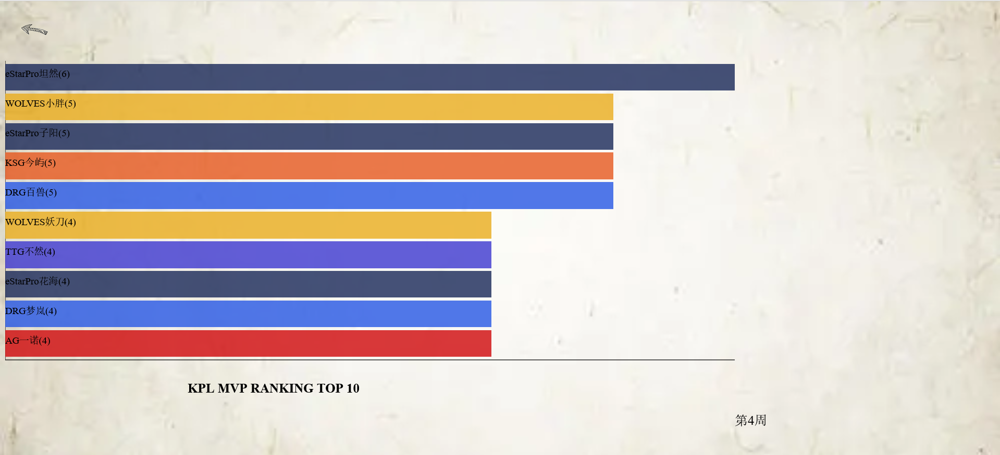
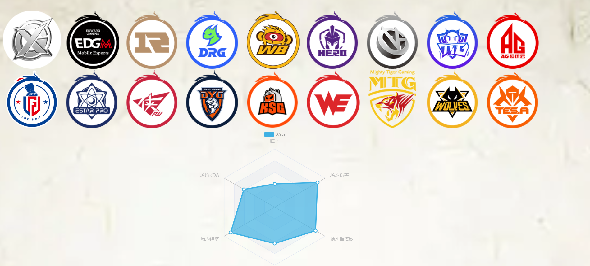
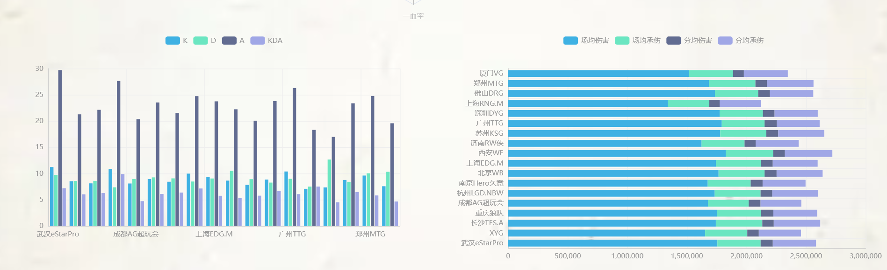
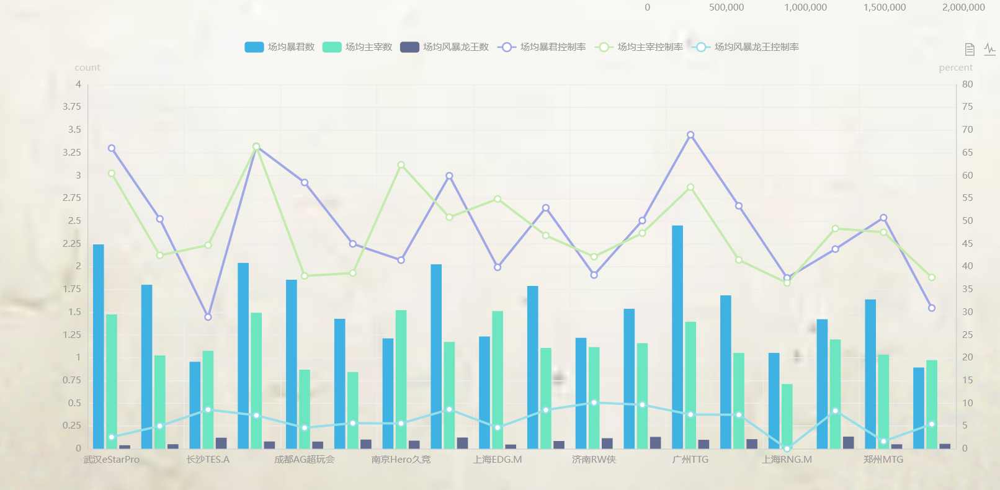
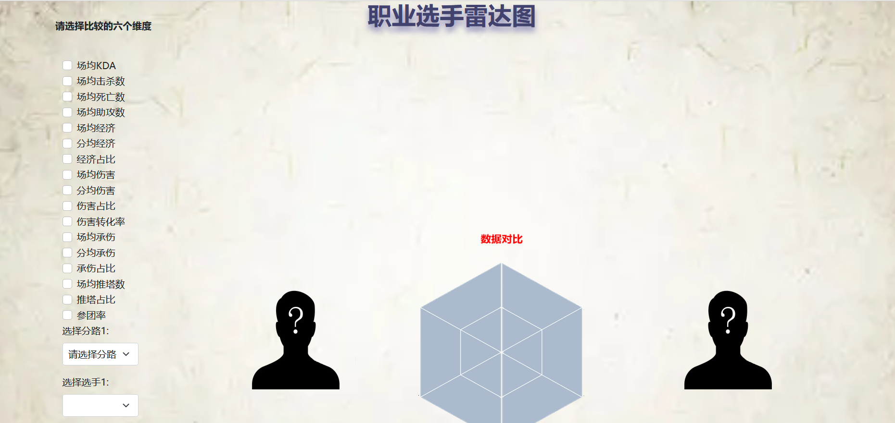
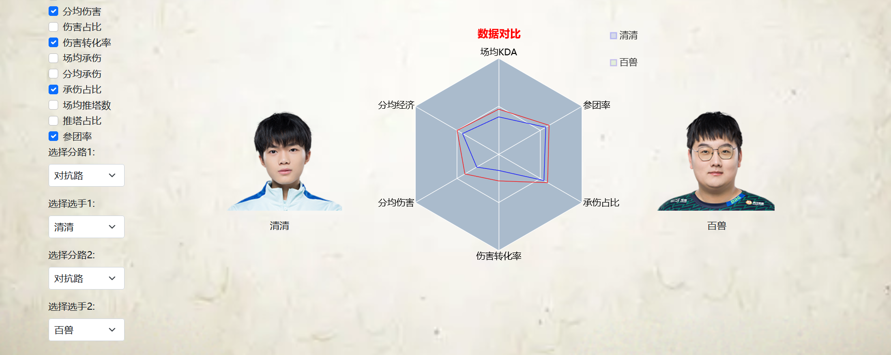
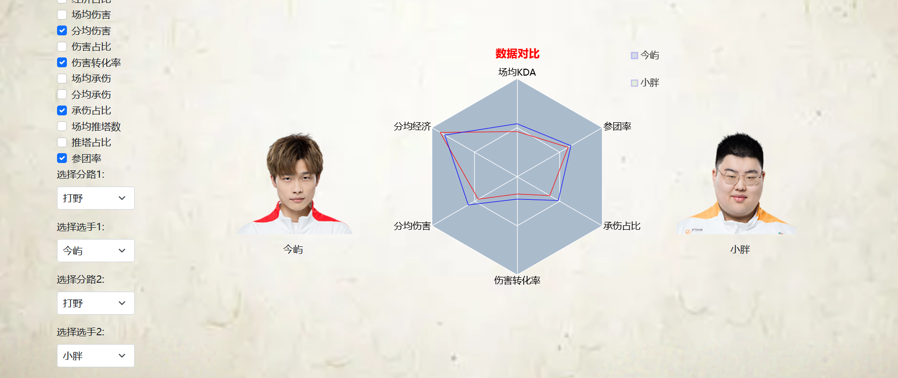

# 可视化大作业

#### prototype

**本小组可视化的主题是KPL赛事，主要通过对KPL赛事的相关数据可视化，直观地对比各个选手的实力，动态地展示选手的赛季变化，清晰地展示赛事登场较多的选手和英雄以及战队的实力。**

**对于选手的实力对比部分，计划使用经典的雷达图进行多维数据的对比，做到可以任意选择选手进行对比。**

**对于动态展示选手赛季变化部分，计划使用条形竞赛图实现。**

**对于首页，统计选手出场次数，英雄出场率，战队胜率构建KPL的词云。**

#### 最终demo展示：

##### 词云：

##### MVP次数变化：

**不断动态展示前10名的变化**

##### 战队数据对比：

##### 个人数据对比：

